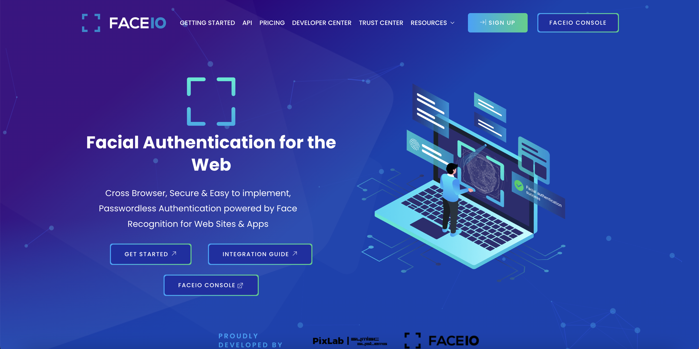
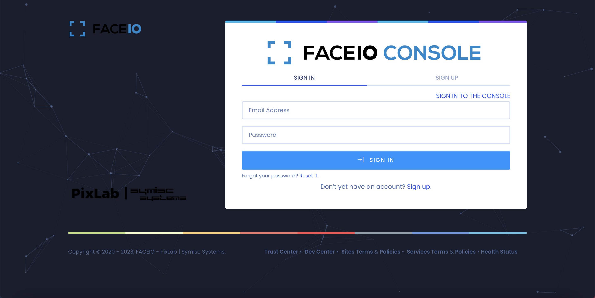
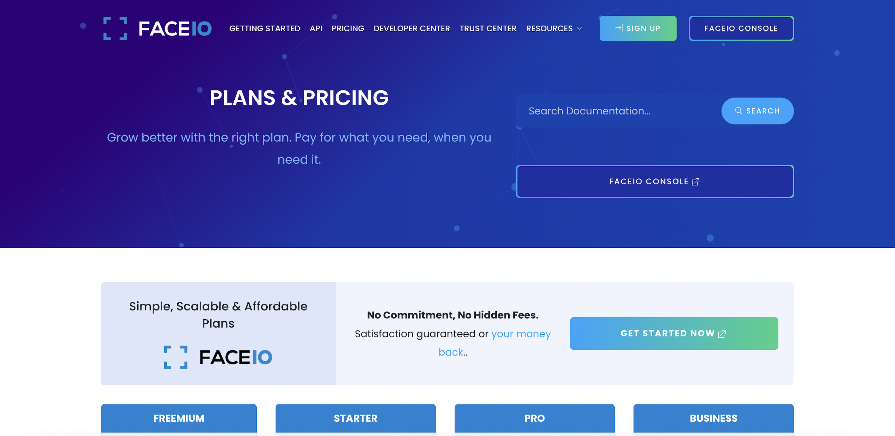
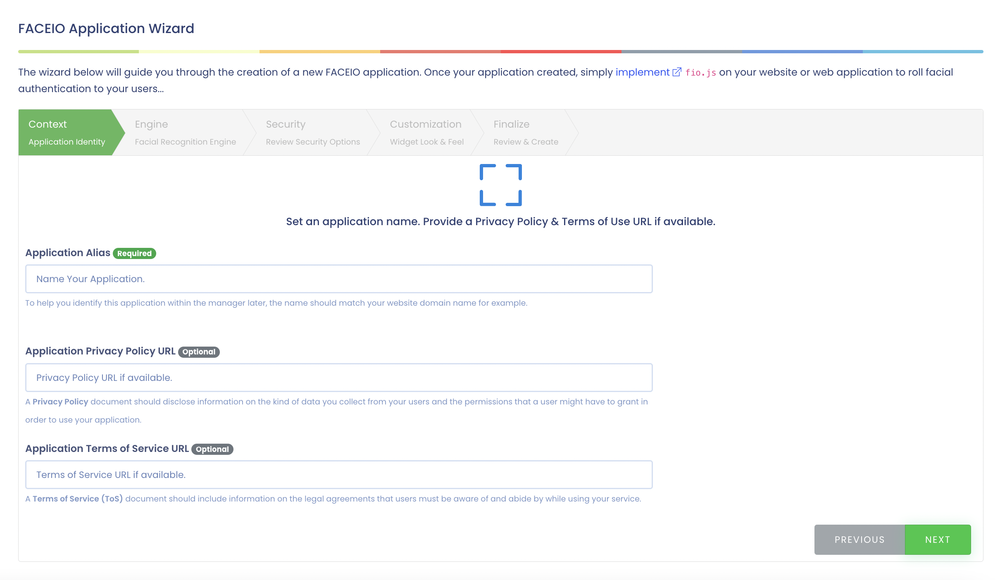
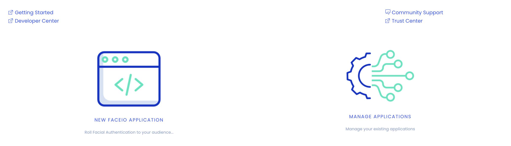
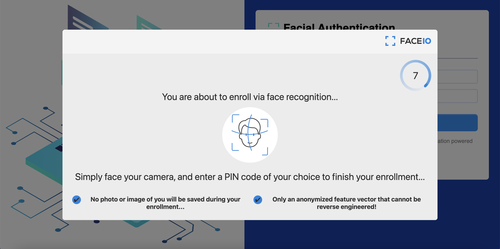
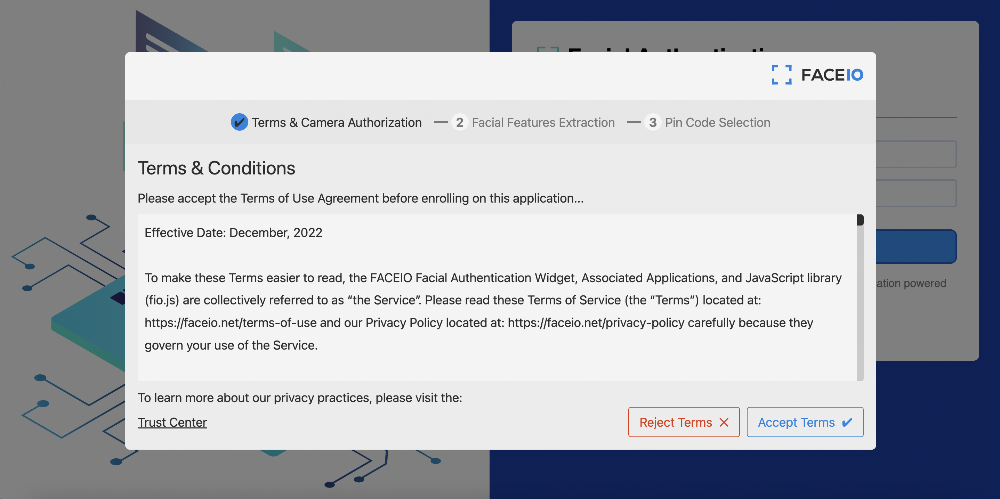
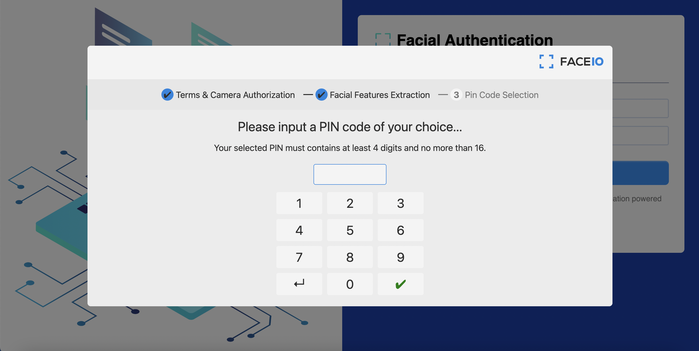
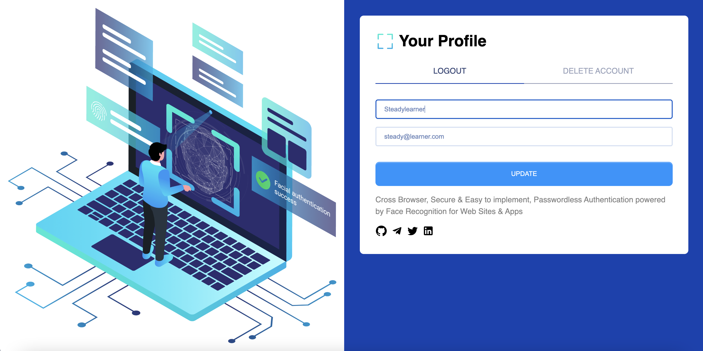

[FACEIO website]: https://faceio.net
[FACEIO console]: https://console.faceio.net
[FACEIO pricing]: https://faceio.net/pricing

[FACEIO example]: https://github.com/steadylearner/faceio_example

[iron-session]: https://www.npmjs.com/package/iron-session
[sequelize-cli]: https://www.npmjs.com/package/sequelize-cli

[Next js sqlize repository]: https://github.com/FlafyDev/next-js-sqlite 

[You can follow me at GitHub.]: https://github.com/steadylearner

[You can contact or hire me at Telegram.]: https://t.me/steadylearner

# How to make a full stack facial authentication app with FaceIo and Next js


With the growing interest in [ChatGPT](https://openai.com/blog/chatgpt/), people will start to use more data scienece and machine learning tech behind it, I am sure this year and on a lot of new techs relevant to them will be around us.

Therefore, I decided to make a simple facial authenticaiton full stack app with [FACEIO][FACEIO website] and Next js. When you end following this blog post, you will have an app similar to the cover of this blog post.

## What is FACEIO?

When you visit [their website][FACEIO website], you will see this phrase.

```
Facial Authentication for the Web

Cross Browser, Secure & Easy to implement, Passwordless Authentication powered by Face Recognition for Web Sites
```



But, you can simply think they will help your users to make accounts at your website with facial authentication process. Instead of investing a lot to make the facial recognition service used behind to work, you can use their service isntead and save a lot of dev time.

You might think it would be difficult to use it like I did. But, you can see how it is easy to use it with the [FACEIO example] I built for this post. 

It uses the [Next js](https://nextjs.org/) for the frontend and backend server and [Sqlite](https://www.sqlite.org/index.html) for the database. They are both easy to set up and with the commands I will share you, it won't be difficult to test the example on your own as well.



Before you test the code at [FACEIO example] repository, please visit [FACEIO console] and make a test account. You will not be charged and will be using the free FREEMIUM option as a default. This will be enough to test the code shared for this so don't worry about that.

If you want to, you can visit [FACEIO pricing] to see more details.



Then, you can make a new application by following the process and you will have **Application Public ID** at the end that will be used at the frontend of your app. 



You can also find FACEIO_API_KEY at manage application page that will be used to remove facial ids you will have later.



## Prepare a .env file

You can set up your .env file similar to this after you follow the previous process.

```
NEXT_PUBLIC_FACEIO_APPLICATION_PUBLIC_ID=<yours>
FACEIO_API_KEY=<yours>

SESSION_AUTHENTICATION_CREDENTIAL=<your random credential>
```

SESSION_AUTHENTICATION_CREDENTIAL is for [iron-session] that we will use to save user data at the backend later. You can decide what you want to use. Please, read its documentations.

## Test the repository

Having .env file ready, you will be able to test the frontend part of the repository with these commands.

```console
$git clone https://github.com/steadylearner/faceio_example.git
$yarn
$yarn dev 
```

But, to make the backend work as well, you will need to set up the sqlite database first. I have prepared the script while I referred to [Next js sqlize repository]. It has not much documentation for it, but it will be useful if you want to write more advanced examples later.

```console
$yarn reset-database
```

The command will create a new database.db file or reset it if you already have the file. Then, you can use `$npx sequelize-cli init` command below to make migraitons folder and other files to help you use sqlite database.

You will see config/config.json file is created in your folder. It is also already included in the repository.

```json
{
  "development": {
    "username": "root",
    "password": null,
    "host": "./database.db",
    "dialect": "sqlite"
  },
  "test": {
    "username": "root",
    "password": null,
    "host": "./database.db",
    "dialect": "sqlite"
  },
  "production": {
    "username": "root",
    "password": null,
    "host": "./database.db",
    "dialect": "sqlite"
  }
}
```

You should edit it in case you want to use another database. For more details, please read docs at [sequelize-cli] and https://sequelize.org/docs/v6/other-topics/migrations documentation.

By the way, if you want to use Postgresql, you can refer to this blog post https://dev.to/steadylearner/how-to-set-up-postgresql-and-pgadmin-with-docker-51h

Then, you can use this comamnd to make your first migraiton file for users we will use for the facial authentication app. It will create a create-user.js migraiton file at migrations folder.


```console
$yarn sequelize-cli model:generate --name Test --attributes facialId:string,name:string,email:string
```

You can paste the code below to it.

```js
'use strict';
/** @type {import('sequelize-cli').Migration} */
module.exports = {
  async up(queryInterface, Sequelize) {
    await queryInterface.createTable('Users', {
      id: {
        type: Sequelize.UUID,
        allowNull: false,
        primaryKey: true,
        defaultValue: Sequelize.UUIDV4,
      },
      facialId: {
        type: Sequelize.STRING,
        allowNull: false,
        unique: true,
      },
      name: {
        type: Sequelize.STRING,
        allowNull: false,
      },
      email: {
        type: Sequelize.STRING,
        allowNull: false,
        unique: true,
      },
      createdAt: {
        allowNull: false,
        type: Sequelize.DATE
      },
      updatedAt: {
        allowNull: false,
        type: Sequelize.DATE
      }
    });
  },
  async down(queryInterface, Sequelize) {
    await queryInterface.dropTable('Users');
  }
};
```

id, createdAt, updatedAt should be auto generated by the sequelize-cli and we need to edit some details for facialId, name and email.

If you want to edit and include more fields later, please read https://sequelize.org/docs/v6 documentation.

You can see this will be similar to models/user.js and you should update both of them whenever you need to edit some of them.

Currently, your database (database.db) will be empty. For our migraiton file and model/user.js file is ready, we can use the command you can see at the database.

```console
$yarn sqlite-upgrade
```

Before you do something else, use this to see you can revert the update.

```console
$yarn sqlite-downgrade
```

If everything works fine, use `$yarn sqlite-upgrade` command again and use `$sqlite3 database.db` or command equivalent to sqlite3 in your operating system.

It will show some command like this. You can type .help in it to see available commands and test some of them.


```console
SQLite version
sqlite>

.tables
SequelizeMeta  Users
SELECT * FROM users;
```

You can use SQL command in it and you will see nothing yet. For example, `SELECT * FROM users;` will not return any data. 

Everything is ready to test the repository, we can finally see how to test the app you did see at the cover of this blog post.

## Test the frontend and FaceIO authentication process


You can use the `$yarn dev` and it will show the page similar to this at your localhost.

To start, you can see the simplified code below for index.tsx or see the entire code base https://github.com/steadylearner/faceio_example/blob/main/src/pages/index.tsx instead.

```tsx
import { useState } from "react";
import { toast } from "react-toastify";

import { useRouter } from "next/router";
import Head from "next/head";

import { validateName, validateEmail } from "../validateUser";
import { useAuthentication } from "../contexts/authenticaiton";

export default function Home() {
  const router = useRouter();

  const {
    enrollNewUser, 
    authenticateUser, 

    user,
  } = useAuthentication();

  const [name, setName] = useState("");
  const [email, setEmail] = useState("");

  return (
    <>
      <nav>
        <div>
          SIGN IN
        </div>
        <div
          onClick={authenticateUser}
        >
        SIGN UP
        </div>
      </nav>

      <form>
        <div>
          <input
            value={name}
            onChange={e => {
              setName(e.target.value);
            }}
          />

          <input
            type="email"
            placeholder="steady@learner.com"

            value={email}
            onChange={e => {
              setEmail(e.target.value.toLowerCase());
            }}
          />
        </div>

        <button
          type="button"
          onClick={async () => {
            if (validateName(name) === false) {
              toast.info("Please use a valid name");
              return;
            }
            if (validateEmail(email) === false) {
              toast.info("Please use a valid email");
              return;
            }
            
            await enrollNewUser(name, email);
          }}
        >
          SIGN IN
        </button>
      </form>
    </>
    
  );
}
```

Reading and testing the code, you will see enrollNewUser, authenticateUser from is what we really need for this page to work.

You can see it at https://github.com/steadylearner/faceio_example/blob/main/src/contexts/authenticaiton.tsx page or this below.

```tsx
import React, { createContext, useState, useContext, useEffect } from "react";
import { toast } from "react-toastify";
import { useRouter } from "next/router";

import faceIO from '@faceio/fiojs';

import { FACEIO_APPLICATION_PUBLIC_ID } from "../environment";
import { apiLogin, apiLogout, apiRegister, register } from "../api/v1/user";
import { UserValidationResult } from "../validateUser";

const AuthenticationContext = createContext({});

export const AuthenticationProvider = ({ children }) => {
  const router = useRouter();

  const [faceIo, setFaceIo] = useState(null);
  const [user, setUser] = useState(null);

  useEffect(() => {
    setFaceIo(new faceIO(FACEIO_APPLICATION_PUBLIC_ID));
  }, []);

  async function restartSession() {
    const restarted = await faceIo.restartSession({});
    return restarted;
  }

  async function enrollNewUser(name, email) {
    try {
      const { facialId, timestamp, details } = await faceIo.enroll({
        "locale": "en", 
        // "locale": "auto", // Default user locale
      });

      toast.info("User Successfully Enrolled!");
      toast.info(`Unique Facial ID: ${facialId}`);
      toast.info(`Enrollment Date: ${timestamp}`);
      toast.info(`Gender: ${details.gender}`);
      toast.info(`Age Approximation: ${details.age}`);

      const registerResult = (await apiRegister(facialId, name, email)) as UserValidationResult; 
      if (UserValidationResult.None === registerResult) {
        toast.info("Your account was created");
        toast.info("Use the sign up button to login");
        
        setTimeout(() => {
          window.location.reload();
        }, 6000);
      } else {
        toast.error(registerResult.toString())
      }

    } catch (error) {
      console.error(error);
      toast.error(handlefaceIoError(error));

      const restarted = await restartSession();
    }

  }

  async function authenticateUser() {
    try {
      const userData = await faceIo.authenticate({
        "locale": "en",
        // "locale": "auto", // Default user locale
      });
      
      const { facialId } = userData;
      const { user, error } = await apiLogin(facialId);

      if (error) {
        toast.error(error);
        return;
      }

      if (user) {
        setUser(user);
        router.push("/profile")
      }
    } catch (error) {
      console.error(error);
      toast.error(handlefaceIoError(error));

      const restarted = await restartSession();
    }
    
  }

  async function logout () {
    try {
      const restarted = await restartSession();
      await apiLogout();
  
      setUser(null);

      window.location.href = "/";

    } catch (error) {
      console.error(error);
      toast.error(error);
    }
  }

  return (
    <AuthenticationContext.Provider value={{
      restartSession, 

      enrollNewUser, 
      authenticateUser, 

      user,
      setUser,
      
      logout
    }}>
      {children}
    </AuthenticationContext.Provider>
  );
};

export const useAuthentication = () => useContext(AuthenticationContext);
```

There are many lines of code but most of them are from [the getting started doc from FACEIO](https://faceio.net/getting-started) webiste. They are modified and included at context/authentication.tsx with React provider API to help you use it inside React app.

If you read the doc, you will find they give you **enrollNewUser, authenticateUser, restartSession and handleError** functions. You can think enrollUser to register, authenticateUser to login and restartSession is something you can use when one of them had any problem.

In their official example, handleError logs a message to console but it is better to return value so you can reuse in somewwhere else easily later. Therefore, you can use this function instead with [react-toastify](https://www.npmjs.com/package/react-toastify) or others to show notifications.

```js
const handlefaceIoError = (error) => {
  switch (error) {
  case error.PERMISSION_REFUSED:
    return "Access to the Camera stream was denied by the end user";
  case error.NO_FACES_DETECTED:
    return "No faces were detected during the enroll or authentication process";
  case error.UNRECOGNIZED_FACE:
    return "Unrecognized face on this application's Facial Index";
  case error.MANY_FACES:
    return "Two or more faces were detected during the scan process";
  case error.FACE_DUPLICATION:
    return "User enrolled previously (facial features already recorded). Cannot enroll again!";
  case error.PAD_ATTACK:
    return "Presentation (Spoof) Attack (PAD) detected during the scan process";
  case error.FACE_MISMATCH:
    return "Calculated Facial Vectors of the user being enrolled do not matches";
  case error.WRONG_PIN_CODE:
    return "Wrong PIN code supplied by the user being authenticated";
  case error.PROCESSING_ERR:
    return "Server side error";
  case error.UNAUTHORIZED:
    return "Your application is not allowed to perform the requested operation (eg. Invalid ID, Blocked, Paused, etc.). Refer to the FACEIO Console for additional information";
  case error.TERMS_NOT_ACCEPTED:
    return "Terms & Conditions set out by FACEIO/host application rejected by the end user";
  case error.UI_NOT_READY:
    return "The FACEIO Widget could not be (or is being) injected onto the client DOM";
  case error.SESSION_EXPIRED:
    return "Client session expired. The first promise was already fulfilled but the host application failed to act accordingly";
  case error.TIMEOUT:
    return "Ongoing operation timed out (eg, Camera access permission, ToS accept delay, Face not yet detected, Server Reply, etc.)";
  case error.TOO_MANY_REQUESTS:
    return "Widget instantiation requests exceeded for freemium applications. Does not apply for upgraded applications";
  case error.EMPTY_ORIGIN:
    return "Origin or Referer HTTP request header is empty or missing";
  case error.FORBIDDDEN_ORIGIN:
    return "Domain origin is forbidden from instantiating faceIo.js";
  case error.FORBIDDDEN_COUNTRY:
    return "Country ISO-3166-1 Code is forbidden from instantiating faceIo.js";
  case error.SESSION_IN_PROGRESS:
    return "Another authentication or enrollment session is in progress";
  case error.NETWORK_IO:
  default:
    return "Error while establishing network connection with the target FACEIO processing node";
  }
};
```

In the official example, you can use payload to save user datas but as we can save them to the sqlite database we will not need it.

I used locale to "en" for `faceIo.enroll` and `faceIo.authenticate` but you can use "auto" instead. 

There are some details left but as this should be working already, please test the facial authentication process by clicking the sign in button if you haven't yet.


You should type name and email field first and click the sign up button.

For this example, you can use yours instead of Steadylearner and steady@learner.com at the page and you will see this.



Then, you can agree to their terms.



Then, you will need to allow them to use your camera for the facial authentication process.

You might be worried here but they will not share your image directly but use their hashed value instead for sign in process later. It is also easy to delete it with [FACEIO console] and the `$yarn delete-fid` command or DELETE ACCOUNT button at profile page you will see later.

Then, you will see this to save a pin as a safety method.



You can use what you want and you will see some notificaitons from these before.

```js
toast.info("User Successfully Enrolled!");
toast.info(`Unique Facial ID: ${facialId}`);

toast.info(`Enrollment Date: ${timestamp}`);
toast.info(`Gender: ${details.gender}`);

toast.info(`Age Approximation: ${details.age}`);
```

Everything was fine for the signup process if you read "Use the sign up button to login" notification.  

In case you had any problem, you can refresh the page and sign up again.

You can see if it really worked by using the sign in button

You can also use the command below and will be able to see the name and email you used.

```console
$yarn list-users

{
  name: 'Steadylearner',
  email: 'steady@learner.com',
}
```

or you can visit https://console.faceio.net/dashboard to see more details at their website.

When you sign in at the app, you will be redirected to profile page.



It is almost same to the sign up page before but it is with Logout, DELETE ACCOUNT and UPDATE button to edit your name and email you used in the previous process.

You will see what you used instead of Steadylearner and steady@learner.com and test with another name and email to update.

For the purpose of this blog post is about explaining you how to use facial authentication with FaceIO, we will only have this feature for this app but you can use [Next js sqlize repository] as a reference to make more advanced examples.

You can also click LOGOUT button and you will be redirected to sign in again.

You can also test DELETE ACCOUNT button and you will see "Your account and facialId were deleted" notification in case there wasn't any problem and redirect to sign in page again.

In case, if it showed any error, you can use this command to delete a facialId from FaceIO.

```console
$yarn delete-fid

What is the facialId for a user to delete? 
<facialId>
```

with the code below.

```ts
// https://console.faceio.net/

import axios from 'axios';
import * as dotenv from 'dotenv' 

import prompt from "../prompt";
import { FACEIO_API } from "../../src/environment";

// tsconfig.json
// "target": "ES2022",
(async () => {
  dotenv.config();

  const { FACEIO_API_KEY } = process.env;

  const facialId = prompt('What is the facialId for a user to delete? ');

  const { data } = await axios.get(`${FACEIO_API}/deletefacialid?${new URLSearchParams({
    fid: facialId,
    key: FACEIO_API_KEY,
  }).toString()}`);

  const { status, error } = data;

  if (status !== 200) {
    console.error(error);
  } else {
    console.log("The facialId was deleted")
  }
})();
```

You can also remove the user from your sqlite database with this.

```console
$yarn delete-user
```

It gives you an option to delete all users or a user with a facialId.

These CLIs at scripts folder are what you can use at the backend apis we will see later also. 

You can test the other commands relevant to them. You can see them at the repository packages.json file.

Test them first before we go to the backend part if you want to.

So far, we could make an account with FaceIO with a name and email, sign in to the profile page. Edit the name and email you used. You could also logout or delete the account without any issue.

I think these were enough to use the FaceIO with React or Next js frontend. 

If you just wanted to learn how to use facial authentication process with FaceIO, you can stop here and make your own app with it. 

There are still some parts left to explain how the backend of this work so I will explain them to help you in case you are interested.

## Backend

In the start of the blog post, we set up some database but I didn't explain many details of how the backend of this project works.

So we have validateUser.ts to validate a name and email input from users.

```ts
enum UserValidationResult {
  None,
  // InvalidUsername,
  InvalidEmail,
  InvalidName,
  // TakenUsername,
  TakenFacialId,
  TakenEmail,
}

export const validateEmail = (email?: string) =>
  email && /^[^\s@]+@[^\s@]+\.[^\s@]+$/.test(email);

export const validateName = (name?: string) =>
  name && /^[a-zA-Z][a-zA-Z ]{1,32}$/.test(name);

const validateUser = (
  name?: string, 
  email?: string
) => {
  if (!validateName(name)) {
    return UserValidationResult.InvalidName;
  }
  if (!validateEmail(email)) {
    return UserValidationResult.InvalidEmail;
  }

  return UserValidationResult.None;
};

export { UserValidationResult };
export default validateUser;
```

This is not much complicated and it is used for both frontend and backend. I don't think you will need much explanation here. You can update regex used for email and name depending on your needs.

Then, there is `withSession.ts` file which will be the main part for the backend.

```ts
import {
  GetServerSidePropsContext,
  GetServerSidePropsResult,
  NextApiHandler,
  NextApiRequest,
  NextApiResponse,
} from "next";

import NextCors from 'nextjs-cors';

import { withIronSessionApiRoute, withIronSessionSsr } from "iron-session/next";
import { CORS_ALLOWED_ORGIN } from "./environment";

// https://www.npmjs.com/package/iron-session
declare module "iron-session" {
  interface IronSessionData {
    user?: {
      id: string;
      // facialId: string;
      name: string;
      email: string;
      createdAt: Date;
      updatedAt: Date;
    };
  }
}

const sessionOptions = {
  cookieName: "SESSION_AUTHENTICATION_CREDENTIAL",
  password:
    process.env.SESSION_AUTHENTICATION_CREDENTIAL ??
    (() => {
      throw "No cookie secret";
    })(),
  cookieOptions: {
    // maxAge: 600, // Reset after 600 seconds.
    secure: process.env.NODE_ENV === "production",
  },
};

function withNextCors(
  handler: NextApiHandler,
): NextApiHandler {
  return async function nextApiHandlerWrappedWithNextCors(req, res) {
    
    // console.log(1);
    
    const methods = ['GET', 'HEAD', 'PUT', 'PATCH', 'POST', 'DELETE'];
    await NextCors(req, res, {
      methods,
      // origin: "https://www.test.com",
      origin: CORS_ALLOWED_ORGIN,
      // optionsSuccessStatus: 400,
      optionsSuccessStatus: 200,
    });

    return handler(req, res);
  };
}

export function withNextCorsSessionRoute(handler: NextApiHandler) {
  const withSessionHandler = withIronSessionApiRoute(handler, sessionOptions);
  return withNextCors(withSessionHandler);
}

export function withSessionSsr<
  P extends { [key: string]: unknown } = { [key: string]: unknown }
>(
  handler: (
    context: GetServerSidePropsContext
  ) => GetServerSidePropsResult<P> | Promise<GetServerSidePropsResult<P>>
) {
  return withIronSessionSsr(handler, sessionOptions);
}
```

Most part of it is to make [iron-session] work to save user data at session and withNextCors function is included to use CORS for all Next js api routes and wrap the `const withSessionHandler = withIronSessionApiRoute(handler, sessionOptions);` to use CORS along with session.

```ts
import NextCors from 'nextjs-cors';

function withNextCors(
  handler: NextApiHandler,
): NextApiHandler {
  return async function nextApiHandlerWrappedWithNextCors(req, res) {
    
    const methods = ['GET', 'HEAD', 'PUT', 'PATCH', 'POST', 'DELETE'];
    await NextCors(req, res, {
      methods,
      origin: CORS_ALLOWED_ORGIN,
      optionsSuccessStatus: 200,
    });

    return handler(req, res);
  };
}

export function withNextCorsSessionRoute(handler: NextApiHandler) {

  const withSessionHandler = withIronSessionApiRoute(handler, sessionOptions);
  return withNextCors(withSessionHandler);
}
```

It was not easy to make the example for this while we have [nextjs-cors](https://www.npmjs.com/package/nextjs-cors) you can use for a handler. With this set up, you will be able to use session and CORS at the same time for all Next js api routes.

You will be able to test if CORS is working with this or not. You can use your browser console and use `fetch('http://localhost:3000/api/v1/user/logout');` and it will show CORS related errors if you use CORS_ALLOWED_ORIGIN other than "*".

You can see the example use case at the user end point or logout and others.

```ts
import { DataTypes } from "sequelize";

import { withNextCorsSessionRoute } from "../../../../withSession";
import {
  sequelize,
} from "../../../../../db";

import { UpdateUserRequest } from "../../../../../schemas/user";

const User = require('../../../../../models/user')(sequelize, DataTypes);

// https://www.npmjs.com/package/next-connect
export default withNextCorsSessionRoute(async (req, res) => {
  if (req.method !== "PATCH") {
    res.status(405).send("");
    return;
  }

  if (req.session.user) {
    const { id } = req.session.user;

    const { name, email } = req.body as UpdateUserRequest;
    const usersUpdated = (await User.update(
      {
        name,
        email,
      },
      {
        where: {
          id,
        }
      }
    ))[0];

    if (usersUpdated === 0) {
      res.status(400).send({
        error: "Unable to update the proifle"
      });
    } else {
      const updatedUser = {
        ...req.session.user,
        name,
        email,
      }

      req.session.user = updatedUser;
      await req.session.save();

      res.json({
        updatedUser,
      })
    }

  } else {
    res.status(400).send({
      error: "Login first"
    });
  }
});
```

For facialId is used like unique password here, it will be better to be include more safety method like CORS and others whenever possible.

Therefore, we can also use the [checkfacilid api from FaceIO](https://faceio.net/rest-api#checkfacialid) to see the facialId from the frontend is really from FaceIO.

It is a paid API so you will need to see [FACEIO pricing] and see which plan to use if you want to use it.

```ts
const { status, error, valid } = await (await fetch(`${FACEIO_API}/checkfacialid?${new URLSearchParams({
  fid: facialId,
  key: FACEIO_API_KEY,
}).toString()}`)).json();

if (status !== 200) {
  res.status(400).send({
    error
  });
}

if (valid === true) {
  // Continue here
}
```

## Conclusion

I hope having this example and blog post was helpful to you start to testing the facial authenticaiton app with [FaceIO][FACEIO website].

It will be also useful as a Next js and Sqlite full stack app example.

[You can follow me at GitHub.]: https://github.com/steadylearner

[You can contact or hire me at Telegram.]: https://t.me/steadylearner

<!-- [The post was written because of this.](https://www.reddit.com/r/forhire/comments/10jspes/hiring_reactjs_and_react_native_content_writers/) -->
## Read More

These are other blog posts and the docs that I thought can be useful. You can read them if you want more details.

[FaceIo dev guides](https://faceio.net/dev-guides)
[How to Authenticate a User via Face Recognition in Your Web Application]https://hackernoon.com/how-to-authenticate-a-user-via-face-recognition-in-your-web-application
[How to use Facial Recognition to Enhance user Experience ?]https://sosha.hashnode.dev/how-to-use-facial-recognition-to-enhance-user-experience 
[How to Authenticate a User with Face Recognition in React.js]https://www.freecodecamp.org/news/authenticate-with-face-recognition-reactjs/


